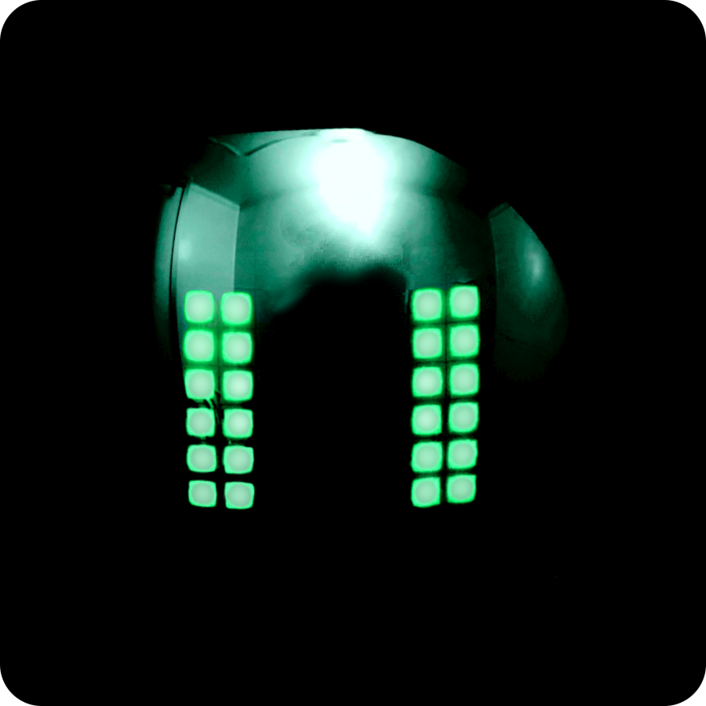

# Cyber Kamen

<p align="center">
  
</p>

- [Web App](https://likeablob.github.io/cyber-kamen-webapp/)

WIP

## Project structure
```
.
├── firmware_esp32 // Firmware code for ESP32 uC (PlatformIO project)
└── structure // 3D-printable models (OpenSCAD files, etc.)
```

## Related projects
- The dedicated Web App for controlling Cyber Kamen devices with BLE (Web Bluetooth).
  - https://github.com/likeablob/cyber-kamen-webapp
